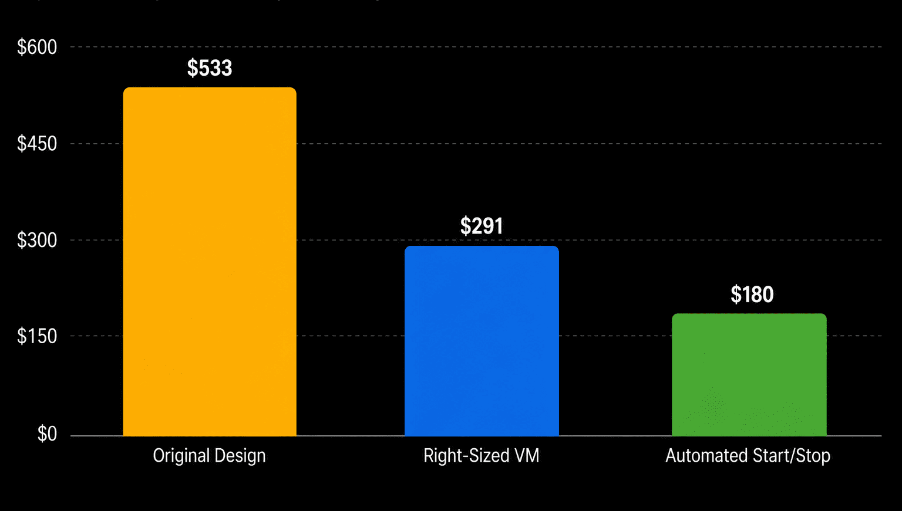

Many organizations run virtual machines in Azure for different purposes. These can be terminal servers, GPU-powered AI workloads, or web servers for internal applications.

One of the biggest advantages of public cloud platforms is flexibility. You can provision almost any amount of CPU, memory, storage, or networking resources within minutes. However, this flexibility can also lead to higher costs if resources are not sized correctly.

To better understand VM costs, I like to divide them into two categories:

## 1. Stateful Components

These components store data and represent the identity of the virtual machine.

Examples:

- OS Disk

- Data Disks

- Public IP Address

These resources continue to exist even when the virtual machine is deallocated and may still incur charges.

## 2. Stateless Components

These resources do not contain data and can be released without affecting the VM's identity.

Examples:

- CPU

- Memory (RAM)

These resources are allocated only while the VM is running and are released when the VM is deallocated.

---

## Initial Design

In a recent internal project, the development team requested the following Linux web server:

| Resource | Monthly Cost |
| --- | --- |
| OS Disk (32 GB Standard SSD) | $3.12 |
| Public IP Address | $2.63 |
| Standard D8ads v5 (8 vCPU, 32 GB RAM) | $528 |
| **Total** | **$533/month** |

The server was intended to host a web service for approximately 100 internal users during business hours.

---

## Step 1: Right-Sizing the VM

The first and most important step in cost optimization is avoiding over-provisioning.

Resources should match actual requirements, not assumptions.

After reviewing the workload, we concluded that a smaller VM would be sufficient.

The final design became:

| Resource | Monthly Cost |
| --- | --- |
| OS Disk (32 GB Standard SSD) | $3.12 |
| Public IP Address | $2.63 |
| Standard D4ads v5 (4 vCPU, 16 GB RAM) | $285 |
| **Total** | **$291/month** |

This simple change reduced monthly costs by approximately **$240**.

### Monthly Cost Comparison

Cost reduction achieved by selecting a VM size that matches actual workload requirements.

**Original Design $533**  
**Right-Sized Design $291**

**Savings $242**

---

## Step 2: Deallocate the VM Outside Business Hours

Can we reduce costs even further?

In this case, yes.

The application is only used during business hours. Therefore, there is no reason to keep CPU and memory allocated overnight.

Azure Pay-As-You-Go pricing is charged based on resource usage time. When a VM is deallocated:

- CPU resources are released

- Memory resources are released

- Compute charges stop

The stateful components (disks and IP addresses) remain available, but their cost is relatively small.

For this project, business hours were defined as:

- Start: 07:00

- End: 20:00

This means the VM only needs to run for 13 hours per day.

We automated the process using:

- Azure Automation Account for start/stop operations

- Azure Logic Apps for notifications to Microsoft Teams and Telegram. These notifications provided daily confirmation that the automation was operating as expected.

---

## Final Result

After implementing automatic deallocation during non-working hours, the monthly cost dropped again:

### Cost Reduction Journey

| Stage | Monthly Cost |
| --- | ---: |
| Original Design | $533 |
| Right-Sized VM | $291 |
| Automated Start/Stop | ~$180 |

---

## Conclusion

Two simple actions delivered significant savings:

1. Select the VM size based on actual workload requirements.

2. Automatically deallocate the VM when it is not needed.

By combining these two approaches, we reduced the monthly cost from **$533 to approximately $180**, achieving a **66% reduction in operating costs** without affecting the application's functionality.

Monthly Savings: ~$353

**Annual Savings: ~$4,236**

> Sometimes the most effective cloud optimization strategies are also the simplest.
